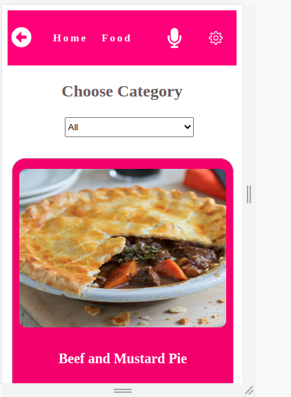
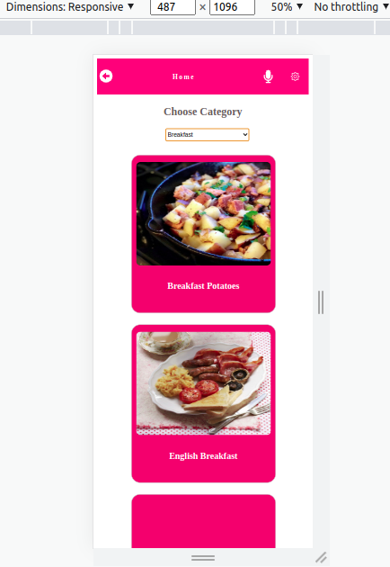
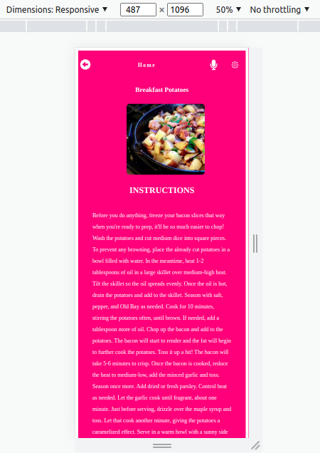

# Healthy Food Recipe

<a name="readme-top"></a>

<div align="center">

  <h3><b>Healthy Food Recipe</b></h3>

</div>


# 📗 Table of Contents

- [📖 About the Project](#about-project)
  - [🛠 Built With](#built-with)
    - [Tech Stack](#tech-stack)
  - [🚀 Live Demo](#live-demo)
- [💻 Getting Started](#getting-started)
  - [Setup](#setup)
  - [Prerequisites](#prerequisites)
  - [Install](#install)
  - [Usage](#usage)
- [👥 Authors](#authors)
- [🔭 Future Features](#future-features)
- [🤝 Contributing](#contributing)
- [⭐️ Show your support](#support)
- [🙏 Acknowledgements](#acknowledgements)
- [📝 License](#license)

# about-project

In this project, I built a dynamic catalogue of food recipes app using react/redux, Axios, promises,amongst other tools.
- `Recipes List page` with a list of recipes that could be filtered by some parameters; in this project, it's a list of recipes that can be filtered by ingredients (shrimp, broccoli, etc.)

- `Recipe Item page` for the recipe details; in this example, the recipe detail page (Preview Recipe)

- In this application, a user can search for recipes by `category` and get a `list of all the meals`. The user can also click on a particular meal to see the details of the ingredients and instructions on how to prepare it.










## 🛠 Built With <a name="built-with"></a>

- React
- Redux
- JSX
- CSS
- JavaScript
- ESLint
- Jest
- Npm
- Axios
- Scss

<!-- Features -->
### Key Features <a name="key-features"></a>

- Fetch and display meals from the API

- Search and display various foods by category.

- Show more information about a food when clicked.

<p align="right">(<a href="#readme-top">back to top</a>)</p>

<!-- LIVE DEMO -->
## 🚀 Live Demo <a name="live-demo"></a>

[Live version](https://641c558986394009d2a50c8e--spectacular-cranachan-840b5f.netlify.app/)


<p align="right">(<a href="#readme-top">back to top</a>)</p>

## 💻 Getting Started <a name="getting-started"></a>

To get a local copy up and running follow these simple example steps.

### Prerequisites

-- **Node.js**
- **ReactJs**
- **NPM**

### Setup

To get a local copy up and running you'll need to have [NodeJS](https://nodejs.org/en/download/) installed on your local machine.

### Install

After installing NodeJS please follow the next steps...

### Usage

```bash

npm i

```

-- for installing dev dependecies.

```bash

npm run build

```

-- to run the project.

### Testing

```bash

npm run start

```

### Deployment

```bash

npm run deploy

```

<p align="right">(<a href="#readme-top">back to top</a>)</p>

<!-- AUTHORS -->

## 👥 Authors <a name="authors"></a>

👤 **Caren Koroeny**

- GitHub: [@Caren-Koroeny](https://github.com/Caren-Koroeny)
- Twitter: [@carensiya](https://twitter.com/home)
- LinkedIn: [CarenSiya](www.linkedin.com/in/caren-siya-a89712180)

<!-- Features -->
## 🔭 Future Features <a name="future-features"></a>

- [ ] **Add good UI/UX**

<p align="right">(<a href="#readme-top">back to top</a>)</p>

<!-- CONTRIBUTING -->
## 🤝 Contributing <a name="contributing"></a>

Contributions, issues, and feature requests are welcome!

Feel free to check the [issues page](../../issues/).

<!-- SUPPORT -->

## ⭐️ Show your support <a name="support"></a>

If you like this project, please don't forget to follow me and give it a star.

<p align="right">(<a href="#readme-top">back to top</a>)</p>

<!-- ACKNOWLEDGEMENTS -->

## 🙏 Acknowledgments <a name="acknowledgements"></a>

- You for viewing this repo and dropping a ⭐️.
- Microverse Inc
- etc

<p align="right">(<a href="#readme-top">back to top</a>)</p>

<!-- LICENSE -->

## 📝 License <a name="license"></a>

This project is [MIT](./MIT.md) licensed.

<p align="right">(<a href="#readme-top">back to top</a>)</p>
